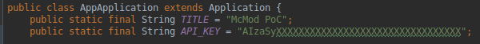
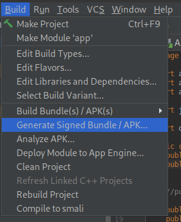
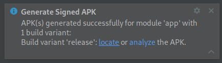
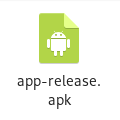
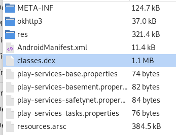

[][donate]

# McMod PoC

This app was made after about 2 days after McDonald's (Plexure to be precise) 
updated their system with an "anti-abuse" system, specifically SafetyNet for 
Android.

## Requirements
* Android Studio (I've used 3.5)
* Original McDonald's APK (I've used version 2.2.0)
* [Original SafetyNet API key](https://github.com/giacomoferretti/ffapi-project/wiki/How-to-get-SafetyNet-API-key-from-the-original-app)

## Steps
1. Open the project in Android Studio
2. Overwrite `API_KEY` in `src/mcdonalds/app/AppApplication` with the key that 
   you've found

	

3. Build the APK

	

4. Go to the release folder (you can click on "locate")

	

5. Extract `classes.dex` from the `app-release.apk` file
	
	

	

6. Use [Janus] to inject the extracted `classes.dex` into the APK

	`./janus.py -d classes.dex mcdonalds.apk poc.apk`

7. Install the APK in your device

## Donate
If this repository helped you in any way, feel free to donate [here][donate].

[donate]: https://paypal.me/hexile0
[janus]: https://github.com/giacomoferretti/janus-toolkit
